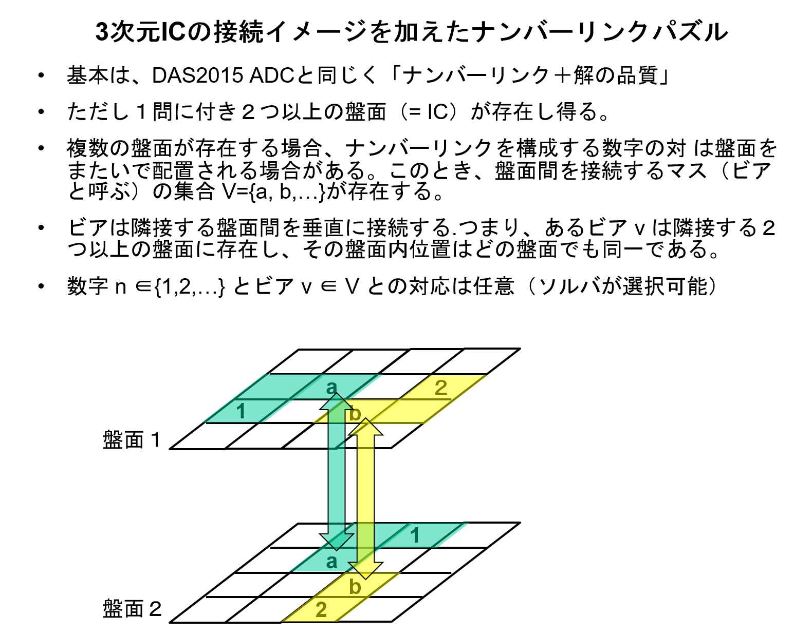
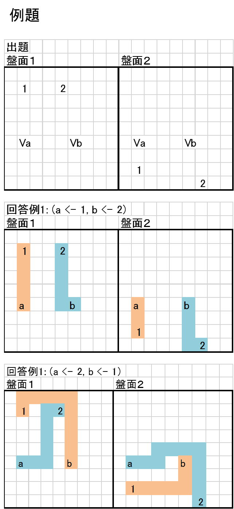
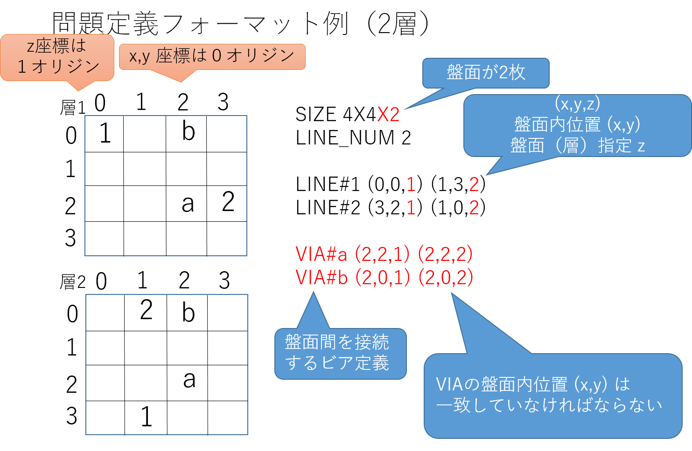
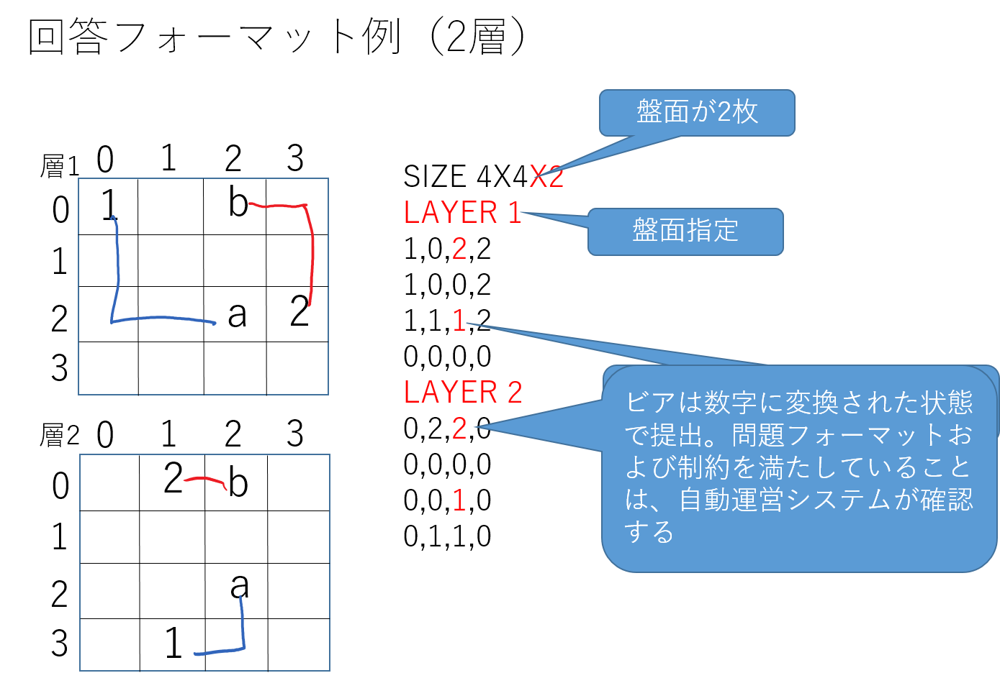
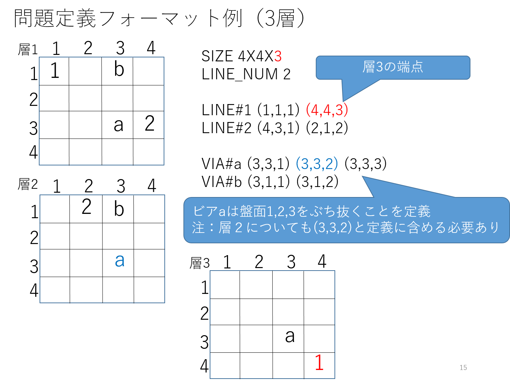
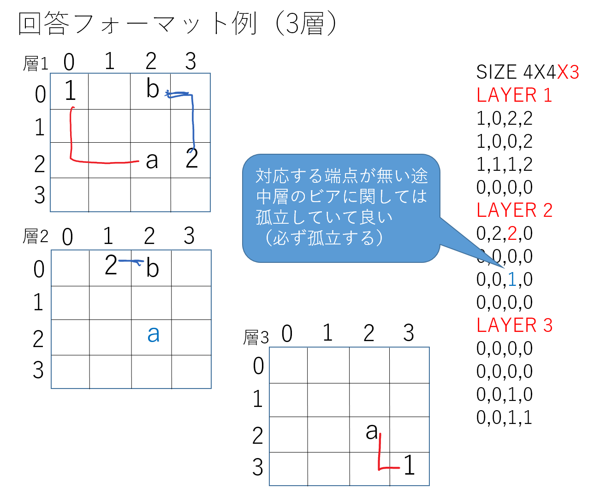
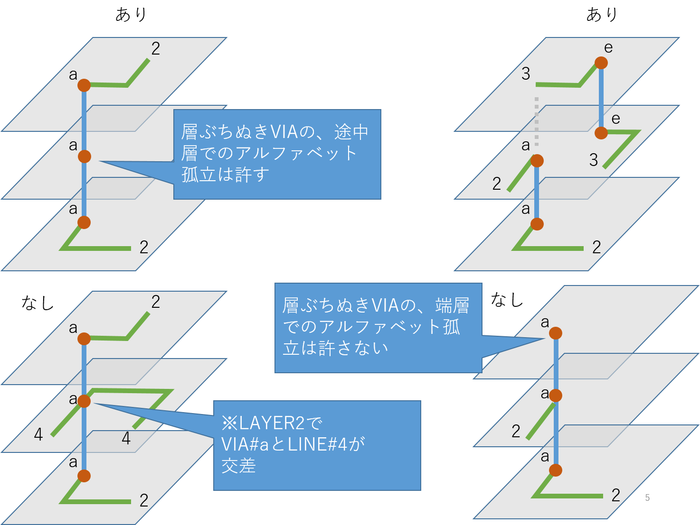
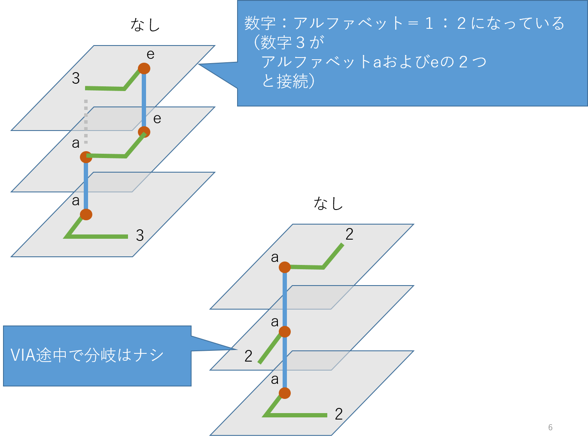
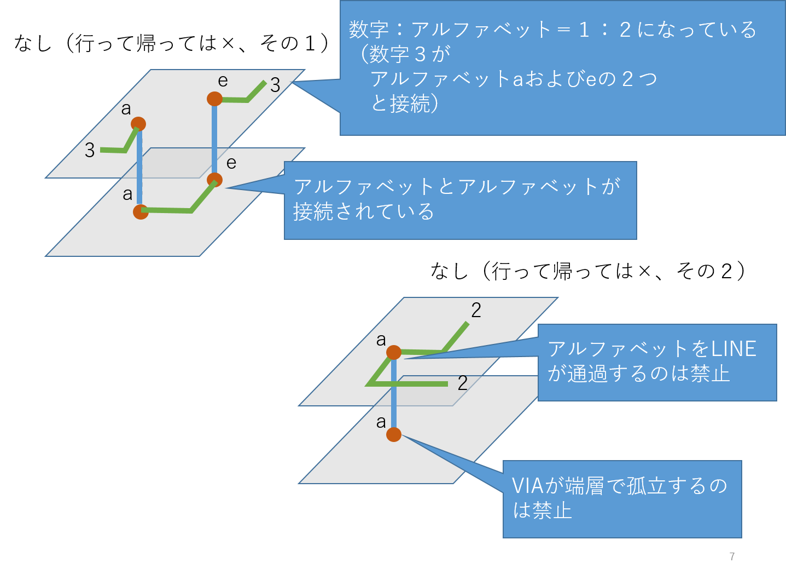

# アルゴリズムデザインコンテスト2016（ADC2016）参加者向けドキュメント

## 目次

* [はじめに](#はじめに)
* [ルール説明](#ルール説明)
* [参加者向けサービスの利用方法](#参加者向けサービスの利用方法)

## はじめに

本ページは、情報処理学会 SLDM研究会主催 DAシンポジウム2016 (DAS2016) 中にて開催される、アルゴリズムデザインコンテスト (ADC2016) の参加者向けページです。
ADC2016参加者にとって必要な情報はすべてこちらでご提供いたします
。

* DAS2016 の Web ページは[こちら](http://www.sig-sldm.org/das/)
* ADC2016 の 概要ページ（DAS2016内）は[こちら](http://www.sig-sldm.org/das/ADC/ADC.html)。

## ルール説明

### 概要

2016年のテーマは、昨年に引き続き、「ナンバーリンク」の解を、自動で求めるシステムのデザイン(設計)です。ナンバーリンクとは、マス目内に数字が配置され、同じ数字の間を、縦横の線で重ならないように結ぶパズルであり、電子回路の自動配線と非常に親和性が高い問題です。
昨年は、「解の品質」を導入し、複数の解がある場合に、もっとも品質のよい解を求めることを目指しました。

　　　（解の品質） ＝ １／（（線長の合計）＋（線が曲がった回数））

今年はさらに歯ごたえのある問題設定とするため、基本はナンバーリンクそのままに、3D配線問題を模した形式に拡張します。拡張内容の概要を以下の図に示します。

| 概要 | 例題  |
| ---  | ---  |
|  |  |

### ルール詳細

* 問題フォーマット

    1. 盤面サイズは [X]X[Y]X[Z] の形で表される
        1. (X,Y): 盤面平面のサイズを表す
        1. Z    : 盤面の層の数を表す
    1. 層数は最大で8 (つまり、Z は 1 <= Z <= 8 を満たす)
    1. LINEとVIAの定義がある
        1. LINE は 連続する数字 (1,2,...) で表される。
        1. VIA は アルファベット (a,b,...) で表される。
            1. アルファベットは連続しなくても良い。
            1. a-z 1文字もしくは2文字から構成される文字列であること。
    1. 各LINEは、LINEを表す数字と、端点を示す複数の位置 (x,y,z) により定義される
        1. LINEは分岐しない、つまり、端点を示す位置の数は2個とする
        1. LINEは層をまたいでも良いし、またがなくても良い。つまり、端点を示す2つの位置 (x1,y1,z1), (x2,y2,z2) について、z1 == z2 でも z1 != z2 でも良い
    1. 各VIAについて、定義中の点数は2以上（複数層にまたがって良い）。複数層にまたがるVIAについて:
        1. その層内位置(x,y)はすべて一致していなければならない
        1. 隣接しない層同士を接続することはない。つまり、その層番号 z は連続していなければならない。
    1. アルファベット(VIA)は必ず数字と接続される
        1. 数字とアルファベットの対応は、1:1 or 1:0
        1. よって LINE数 >= VIA数
    1. 無駄なVIAは存在しない、つまり、 (層をまたぐLINE数)=(VIA数)

* 回答フォーマット

    1. 盤面層数分の2次元回答フォーマットを並べたものがADC2016の回答フォーマットとなる
    1. 2次元回答フォーマット(＝盤面の各層の回答フォーマット)は、各マスに数字を当てはめたものとする（2015年度までと同様）
    1. アルファベットは出現しない
        1. 問題のアルファベット（VIA）の位置には数字（＝VIAに接続されたLINEの数字）が現れる
    1. アルファベット同士の接続は禁止
    1. via途中層は、どの線にも接続されていない孤立点となる

### フォーマット例（2層の場合）

| 問題 | 回答  |
| ---  | ---  |
|   |  |

* 注：問題フォーマットのLINE定義およびVIA定義において、数字位置およびアルファベット位置を示す複数の(x,y,z)の間は、空白(" ")もしくはハイフン("-")のどちらかを使用すること。混在しても良い。

### フォーマット例（3層の場合）

| 問題 | 回答  |
| ---  | ---  |
|  |  |

### ルール図解

| アリ・ナシ集 | | |
| ---  | --- | --- |
|  |  |  | 

## 参加者向けサービスの利用方法

(近日公開予定)

