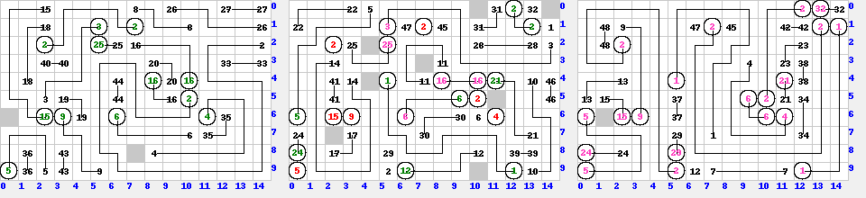

# qgen.py

`qgen.py`は、ランダムな問題データと、その回答データを生成するツールです。

データ生成後、nlcheckを実行して、正しいか確認し、また、nldraw2を実行して、回答のビットマップイメージも生成します。

何をやっているかは、コード中のコメントを見てください。簡単にチューニングできるパラメータもあります。

## 実行例

ヘルプを表示する。

    % ./qgen.py -h
    usage: qgen.py [-h] [-d] [-v] [-x X] [-y Y] [-z Z] [-l N] [-r N] [-o FILE]

    NumberLink Q generator

    optional arguments:
      -h, --help            show this help message and exit
      -d, --debug           enable debug (default: False)
      -v, --verbose         verbose output (default: False)
      -x X                  size X (default: 3)
      -y Y                  size Y (default: 3)
      -z Z                  size Z (default: 1)
      -l N, --lines N       max number of lines (default: 999)
      -r N, --retry N       max number of retry (default: 2)
      -o FILE, --output FILE
                            output file

15x10、3層の問題を作成し、ファイル名のベース部分を`Q_15x10x3`として、結果出力する。

    % ./qgen.py -x 15 -y 10 -z 3 -r 10 -o Q_15x10x3
    number of lines: 48
    number of empty cells: 11
    judges =  [[True, 0.0016863406408094434]]
    Q_15x10x3.1.gif
    Q_15x10x3.2.gif
    Q_15x10x3.3.gif

    % ls Q_15x10x3*
    Q_15x10x3_adc_sol.txt  Q_15x10x3.1.gif        Q_15x10x3.3.gif
    Q_15x10x3_adc.txt      Q_15x10x3.2.gif        Q_15x10x3.gif

サイズの大きい問題を作りたい場合、処理時間が長くなるので、いくつかのオプションの値を小さめに調整します。

    % ./qgen.py -x 60 -y 60 -z 4 -o Q_60_60_4 -r 2 -l 200 -v
    rip LINE#82
    retry 1/2 LINE#82, #dont_use=0
    rip LINE#150
    retry 1/2 LINE#150, #dont_use=0
    retry 0/2 LINE#176, #dont_use=1
    rip LINE#176
    retry 1/2 LINE#176, #dont_use=1
    rip LINE#199
    retry 1/2 LINE#199, #dont_use=1
    number of lines: 200
    number of empty cells: 5783
    judges =  [[True, 8.054123711340206e-05]]
    Q_60_60_4.1.gif
    Q_60_60_4.2.gif
    Q_60_60_4.3.gif
    Q_60_60_4.4.gif
